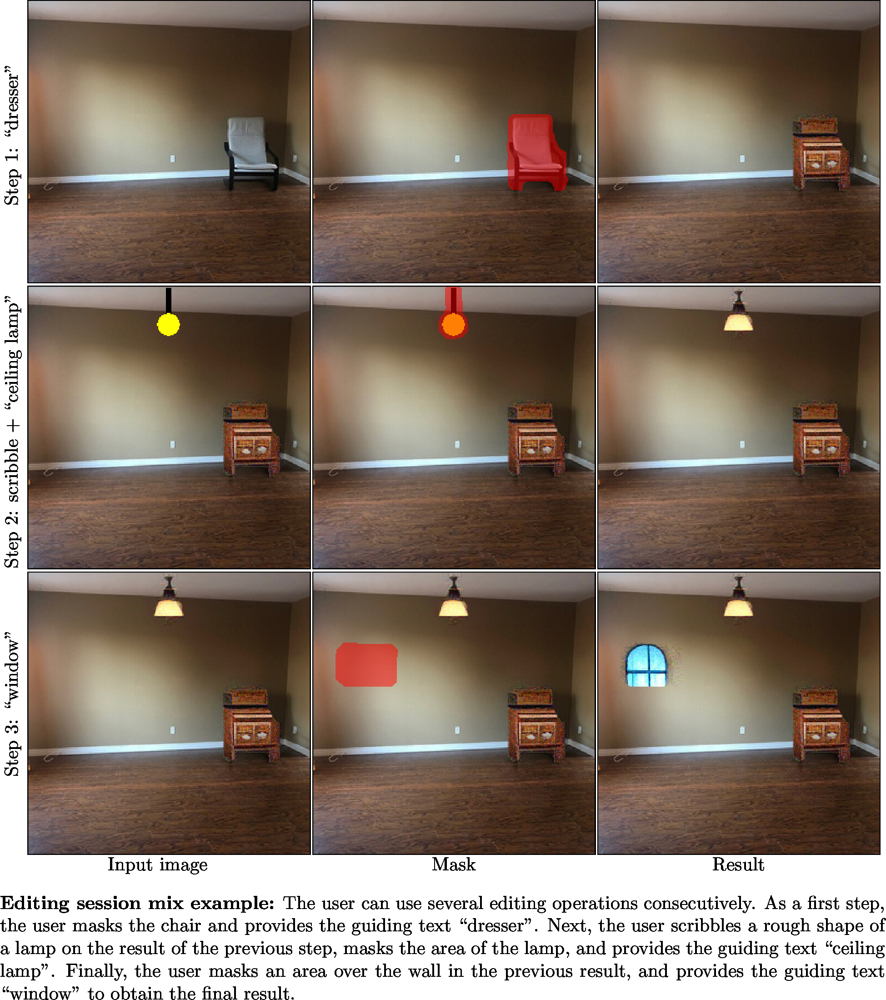

# Blended Diffusion for Text-driven Editing of Natural Images

> **Blended Diffusion for Text-driven Editing of Natural Images**
>
> Omri Avrahami, Dani Lischinski, Ohad Fried
>
> Abstract: Natural language offers a highly intuitive interface for image editing. In this paper, we introduce the first solution for performing local (region-based) edits in generic natural images, based on a natural language description along with an ROI mask.
We achieve our goal by leveraging and combining a pretrained language-image model (CLIP), to steer the edit towards a user-provided text prompt, with a denoising diffusion probabilistic model (DDPM) to generate natural-looking results.
To seamlessly fuse the edited region with the unchanged parts of the image, we spatially blend noised versions of the input image with the local text-guided diffusion latent at a progression of noise levels.
In addition, we show that adding augmentations to the diffusion process mitigates adversarial results.
We compare against several baselines and related methods, both qualitatively and quantitatively, and show that our method outperforms these solutions in terms of overall realism, ability to preserve the background and matching the text. Finally, we show several text-driven editing applications, including adding a new object to an image, removing/replacing/altering existing objects, background replacement, and image extrapolation.

<a href="https://arxiv.org/abs/2111.14818"></a>
<a href="https://opensource.org/licenses/MIT"></a>


# Getting Started
## Installation
1. Create the virtual environment:

```bash
$ conda create --name blended-diffusion python=3.9
$ conda activate blended-diffusion
$ pip3 install ftfy regex matplotlib lpips kornia opencv-python torch==1.9.0+cu111 torchvision==0.10.0+cu111 -f https://download.pytorch.org/whl/torch_stable.html
```

2. Create a `checkpoints` directory and download the pretrained diffusion model from [here](https://drive.google.com/file/d/145NpznbcwMeoX-v8U-bUpu8eXILh3n7Z/view?usp=sharing) to this folder.

## Image generation
An example of text-driven multiple synthesis results:

```bash
$ python main.py -p "rock" -i "input_example/img.png" --mask "input_example/mask.png" --output_path "output"
```

The generation results will be saved in `output/ranked` folder, ordered by CLIP similarity rank. In order to get the best results, please generate a large number of results (at least 64) and take the best ones.

In order to generate multiple results in a single diffusion process, we utilized batch processing. If you get `CUDA out of memory` try first to lower the batch size by setting `--batch_size 1`.

# Applications

### Multiple synthesis results for the same prompt


### Synthesis results for different prompts


### Altering part of an existing object


### Background replacement


### Scribble-guided editing


### Text-guided extrapolation


### Composing several applications



# Acknowledgments
This code borrows from [CLIP](https://github.com/openai/CLIP), [Guided-diffusion](https://github.com/openai/guided-diffusion) and [CLIP-Guided Diffusion](https://colab.research.google.com/drive/12a_Wrfi2_gwwAuN3VvMTwVMz9TfqctNj).

# Citation
If you use this code for your research, please cite the following:
```
@article{avrahami2021blended,
  title={Blended diffusion for text-driven editing of natural images},
  author={Avrahami, Omri and Lischinski, Dani and Fried, Ohad},
  journal={arXiv preprint arXiv:2111.14818},
  year={2021}
}
```