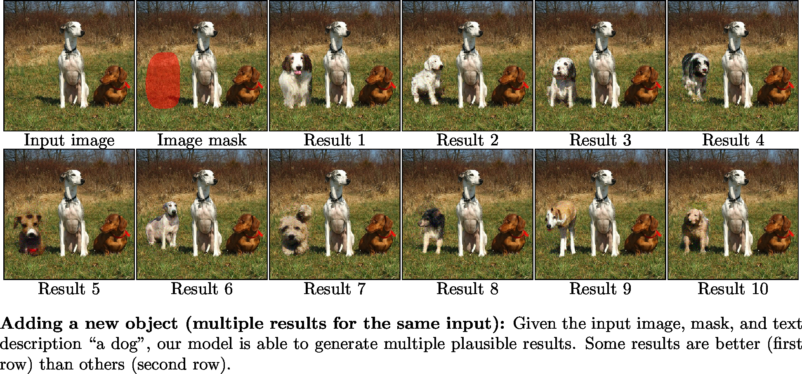
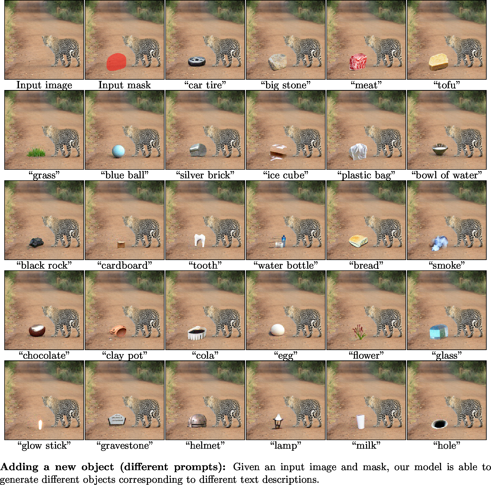
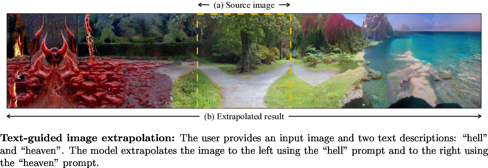

# Blended Diffusion for Text-driven Editing of Natural Images

**Blended Diffusion for Text-driven Editing of Natural Images** 
Omri Avrahami, Dani Lischinski, Ohad Fried 

<!-- Paper: http://todo 
Project Page: https://todo  -->

Abstract: *Natural language offers a highly intuitive interface for image editing. In this paper, we introduce the first solution for performing local (region-based) edits in generic natural images, based on a natural language description along with an ROI mask.
We achieve our goal by leveraging and combining a pretrained language-image model (CLIP), to steer the edit towards a user-provided text prompt, with a denoising diffusion probabilistic model (DDPM) to generate natural-looking results.
To seamlessly fuse the edited region with the unchanged parts of the image, we spatially blend noised versions of the input image with the local text-guided diffusion latent at a progression of noise levels.
In addition, we show that adding augmentations to the diffusion process mitigates adversarial results.
We compare against several baselines and related methods, both qualitatively and quantitatively, and show that our method outperforms these solutions in terms of overall realism, ability to preserve the background and matching the text. Finally, we show several text-driven editing applications, including adding a new object to an image, removing/replacing/altering existing objects, background replacement, and image extrapolation.*

## Applications

### Multiple synthesis results for the same prompt

### Synthesis results for different prompts

### Altering part of an existing object

### Background replacement

### Scribble-guided editing

### Text-guided extrapolation

### Composing several applications

## Code availability
Full code will be released soon.